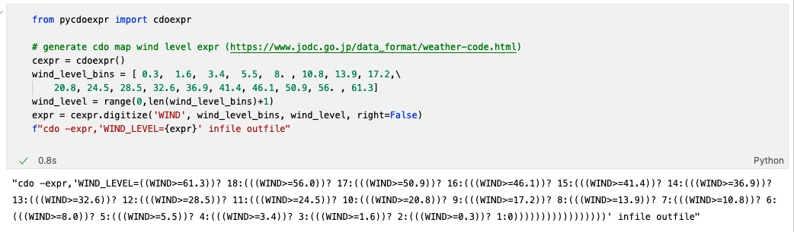
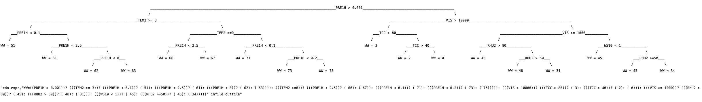
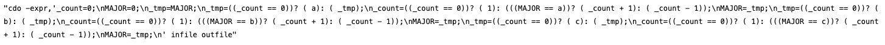
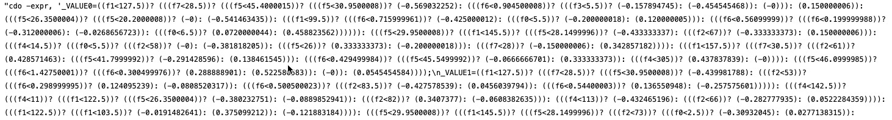

# pycdoexpr



CDO (Climate data operator) is a high-efficient command line tool for climate and meteorology data processing. This Python package helps to generate complicated cdo expr(computing expression) in a convenient and pythonic way.

## Install
Install via pip
```shell
pip install pycdoexpr==0.0.2
```

## Usage
1. generate digitize expr (same as np.digitize)
```python 
from pycdoexpr import cdoexpr

# EX1: use digitize to generate WIND LEVEL expr
wind_level_bins = [ 0.3,  1.6,  3.4,  5.5,  8. , 10.8, 13.9, 17.2,\
    20.8, 24.5, 28.5, 32.6, 36.9, 41.4, 46.1, 50.9, 56. , 61.3]
cexpr = cdoexpr()
cexpr.digitize(varname='WIND_LEVEL', bins=wind_level_bins, right=False)
```

2. convert multi-level conditions string in python syntax to cdo expr 
```python

# EX2: use conditions to generate WW (weather code) expr (https://www.jodc.go.jp/data_format/weather-code.html)
s = '''
if PRE1H > 0.001:
    if TEM2 >= 3:
        if PRE1H < 0.1:
            WW = 51
        elif PRE1H < 2.5:
            WW = 61
        elif PRE1H < 8:
            WW = 62
        else:
            WW = 63
    elif TEM2 >=0:
        if PRE1H < 2.5:
            WW = 66
        else:
            WW = 67
    else:
        if PRE1H < 0.1:
            WW = 71
        elif PRE1H < 0.2:
            WW = 73
        else:
            WW = 75
else:
    if VIS > 10000:
        if TCC > 80:
            WW = 3
        elif TCC > 40:
            WW = 2
        else:
            WW = 0
    elif VIS >= 1000:
        if RHU2 > 80:
            WW = 45
        elif RHU2 > 50:
            WW = 48
        else:
            WW = 31
    else:
        if WS10 < 1:
            WW = 45
        else:
            if RHU2 >=50:
                WW = 45
            else:
                WW = 34
'''
expr = cexpr.conditions(s, verbose=True)
f"cdo expr,'WW={expr}' infile outfile"
```


3. moore voting
```python

# EX3: generate moore voting cdo expression
expr = cexpr.moore_voting(voters=['a' ,'b', 'c'], varname='MAJOR')
f"cdo -expr,'{expr}' infile outfile"
```


4. convert multi xgboost tree to expr with ensemble method (averaging, boosting, moore_voting)  [*(usage in example)*](./example/example_xgb_decision_tree.ipynb)
```python

# EX4: convert a xgb decision trees model to cdo expression

expr = cexpr.xgb_decision_trees('./static/model.pkl',ensemble='averaging')
f"cdo -expr, '{expr}' infile outfile"
```


## Benchmark

> cdo expr vs (np.verctorize calc and xarray io)

- [ ] TODO